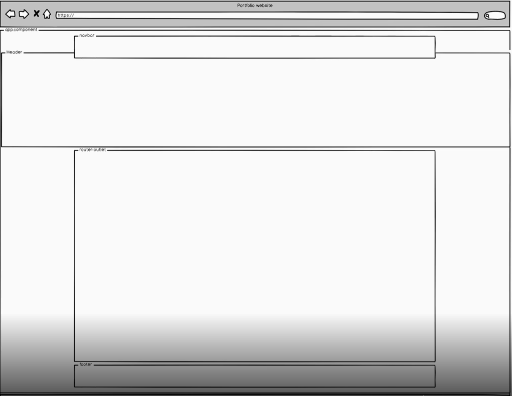

# Responsive
[Back](./angular.md)

[Angular CLI](https://github.com/angular/angular-cli)

[Updating CLI](https://github.com/angular/angular-cli/wiki/stories-1.0-update)

## Setting Up Dev Environment

npm install bootstrap --save

Add the following to styles.scss:  
@import '~bootstrap/scss/bootstrap';

Note: this down loads everything. Ultimately, before website is deployed, need to optimize the importing of bootstrap. Need to take a more targeted approach.

ng add @angular/material

Need to install hammerjs

Add to main.ts:  
import 'hammerjs';

In SCSS a $ is used to define a variable:  
$alt-color: #f2f2f2;  
$accent: #009988;

#### Setup from YouTube

// bootstrap
@import "my-variables";

@import "~bootstrap/scss/functions";
@import "~bootstrap/scss/variables";
@import "~bootstrap/scss/mixins";

@import "~bootstrap/scss/reboot";
@import "~bootstrap/scss/grid";
@import "~bootstrap/scss/utilities";

@import "my-reset";

// material

@import "~@angular/material/theming";

@include mat-core($my-typography);

$my-theme: mat-light-theme($primary, $accent, $warm)
@include angular-material-theme($my-theme);

@mixin gerate-utiltilies($theme) {
   $primary: map-get($theme, primary);
   $accent: map-get($theme, accent);
   
   .my-text-secondary-900 {
        color: mat-color($secondary, 900);
    }
    .my-bg-primary-100 {
       background-color: mat-color($primary, 100);
    }
}

## What is Responsive Web Design (RWD)

* Readable text
* No horizontal scrolling
* Accessible buttons/links

## How to create responsive web site

* Media queries (breakpoints)
* Fluid grids

### Breakpoints
* xl (extra large): min-width: 1200px
* lg (large): min-width: 992px
* md (medium): min-width: 768px
* sm (small): min-width: 576px
* xs (extra small): min-width: 578.98px - and below

### Fluid Grid
* 12 columns

|                     | <576xpx (xs) | >=576px (sm) | >=768px (md) | >=992px (lg) | >=1200px (xl) |  
|---------------------|--------------|--------------|--------------|--------------|---------------|
| Max container Width |  None(auto)  |     540px    |     720px    |     960px    |    1140px     |
|   Class Prefix      |    .col-     |   .col-sm-   |   .col-md-   |    .col-lg-  |    .col-xl-   |

## VSCode

### Recommended Extensions
* Angular Language Service
* ANgular v7 Snippets
* EditorConfig for VSCode
* IntelliSense for CSS class names in HTML

### Bootstrap Container

### Display

* display: none; // removes element from DOM
* visibility: hidden; // hides the element but is still in the DOM
* display: block; // Display as a block element. Starts on new line and takes up entire width
* display: inline; // Displays as a . Any height and width properties have no affect.
* display: inline-block; // Displays as a inline block. Any height and width properties DO have affect.
    
 

    
The media queries effect screen widths with the given breakpoint or larger. For example, .d-lg-none sets display: none; on both lg and xl screens.

Show/hide depending on the breakpoint
* d-none // hide content for all breakpoints
* d-none d-sm-block // hide for xs only
* d-sm-none // show only xs
* d-lg-none d-xl-block // hide only lg

Go to [Bootstrap Getting Started](https://getbootstrap.com/docs/4.4/getting-started/introduction/) page and copy the starter template into the index.html file.

## Graphic Design

CARP

* Contrast Elements being strikingly different from one another
* Alignment
* Repetition - Repeat various elements in design: color, thickness, graphic, text, ...
* Proximity - Group things together

## Colors

  

All of the [bootstrap colors](./bootstrap-colors.md)

The **container** class adds margin and padding to div. It is jumpy when resize window because of the breakpoints.
The **container-fluid** class is smooth when scrolling.

Bootstrap is based on a 12-column layout.

For responsive layout, the container class is optional but to have multi-column layout, need to put columns inside a row tag.
    

        

    

    
## Steps to creating WebSite  
* How many pages
* How will the pages be divided
* How will the content be layed out

  

https://unsplash.com/ For free high res images

## ng-bootstrap

[ng-bootstrap](https://ng-bootstrap.github.io/#/home)

It is a native Angular implementation for Bootstrap components.

* CSS for layout, content, etc
* JavaScript for components.
* No dependency on JQuery

    \<section class="container">  
      \<section class="row">  
        \
Equal\
  
        \
Equal\
  
        \
Equal\
  
        \
Equal\
  
        \
Equal\
  
        \
Equal\
  
        \
Equal\
  
        \
Equal\
  
        \
Equal\
  
        \
Equal\
  
        \
Equal\
  
        \
Equal\
  
      \</section>  
    \</section>  
    
    // this is not responsive, ie as the window width is shrunk, the columns don't stack
     <section class="container">
      <section class="row">
        
Auto
 // this takes up the remaining space. it is auto.
        
Auto

        
Auto

      </section>
    </section>

This is a responsive layout

   <section class="container">
      <section class="row">
        
Auto

        
Auto

        
Auto

      </section>
    </section>
    
    
    nesting 2 columns inside the first column
    
       <section class="container">
      <section class="row">
        

          First
          <section class="row">
            
Second

            
Third

          </section>
        

      </section>
    </section>
    
    
      <section class="container">
      <section class="row">
            

                
SM: 576px MD: 768px LG: 992px XL: 1200px

            

      </section>
    </section>

    <section class="container">
      <section class="row">
        
1

        
2

      </section>
      <section class="row">
        
1

        
2

        
3

      </section>
      <section class="row">
        
1

        
2

        
3

        
4

      </section>
    </section>
